# Enterprise CRM System Architecture
**Version**: 1.0  
**Date**: August 13, 2025  
**Document Owner**: Senior Software Architect  
**Status**: Architecture Blueprint - Ready for Implementation  

---

## Table of Contents
1. [Executive Summary](#1-executive-summary)
2. [High-Level System Architecture](#2-high-level-system-architecture)
3. [Microservices Architecture](#3-microservices-architecture)
4. [Database Architecture & Data Strategy](#4-database-architecture--data-strategy)
5. [Security Architecture](#5-security-architecture)
6. [Integration Architecture](#6-integration-architecture)
7. [AI/ML Pipeline Architecture](#7-aiml-pipeline-architecture)
8. [Deployment Architecture](#8-deployment-architecture)
9. [Technology Stack Specifications](#9-technology-stack-specifications)
10. [Scalability & Performance Strategy](#10-scalability--performance-strategy)
11. [Risk Assessment & Mitigation](#11-risk-assessment--mitigation)
12. [Implementation Guidelines](#12-implementation-guidelines)

---

## 1. Executive Summary

### 1.1 Architecture Vision
The "My Awesome CRM" system is designed as a cloud-native, microservices-based platform that delivers enterprise-grade customer relationship management capabilities with AI-powered insights and seamless third-party integrations. The architecture prioritizes scalability, security, and maintainability while providing sub-second response times for 10,000+ concurrent users.

### 1.2 Key Architectural Principles
- **Cloud-Native Design**: Kubernetes orchestration with containerized microservices
- **Multi-Tenant Architecture**: Logical data isolation with shared infrastructure
- **Event-Driven Architecture**: Asynchronous communication via message queues
- **API-First Approach**: RESTful APIs with GraphQL for complex queries
- **Zero-Trust Security**: Defense-in-depth with end-to-end encryption
- **Horizontal Scalability**: Auto-scaling based on demand metrics

### 1.3 Architecture Quality Attributes
```yaml
performance_targets:
  page_load_time: "<2 seconds (95th percentile)"
  api_response_time: "<200ms (95th percentile)"
  search_response: "<500ms (99th percentile)"
  concurrent_users: "10,000 (15,000 peak)"

availability_targets:
  system_uptime: "99.9% (8.77 hours downtime/year)"
  rto: "15 minutes"
  rpo: "1 hour"

scalability_targets:
  user_growth: "500 to 10,000+ users"
  data_volume: "50M contacts, 500M activities per tenant"
  geographic_reach: "Multi-region deployment"
```

---

## 2. High-Level System Architecture

### 2.1 System Context Diagram

```mermaid
graph TB
    subgraph "External Systems"
        Users[👥 Users<br/>Sales, Support, Admins]
        Mobile[📱 Mobile Apps<br/>iOS, Android]
        Email[📧 Email Systems<br/>Gmail, Outlook]
        Calendar[📅 Calendar<br/>Google, Outlook]
        VoIP[☎️ VoIP Systems<br/>Twilio, RingCentral]
        Marketing[📢 Marketing<br/>HubSpot, Marketo]
        ERP[🏢 ERP Systems<br/>NetSuite, SAP]
    end

    subgraph "CRM Platform"
        LB[🔄 Load Balancer<br/>Global Distribution]
        Gateway[🚪 API Gateway<br/>Authentication & Routing]
        Web[🌐 Web Application<br/>React/Next.js]
        
        subgraph "Core Services"
            Contact[👤 Contact Service]
            Lead[🎯 Lead Service]
            Opportunity[💼 Opportunity Service]
            Activity[📋 Activity Service]
            Communication[💬 Communication Service]
            Analytics[📊 Analytics Service]
            AI[🤖 AI/ML Service]
        end
        
        subgraph "Data Layer"
            MainDB[(🗄️ PostgreSQL<br/>Primary Database)]
            Cache[(⚡ Redis<br/>Caching Layer)]
            Search[(🔍 Elasticsearch<br/>Search Engine)]
            Files[📁 Object Storage<br/>Documents & Files]
        end
        
        subgraph "Infrastructure"
            Queue[📨 Message Queue<br/>RabbitMQ/Kafka]
            Monitor[📈 Monitoring<br/>Prometheus/Grafana]
            Logs[📝 Logging<br/>ELK Stack]
        end
    end

    Users --> LB
    Mobile --> LB
    LB --> Gateway
    Gateway --> Web
    Gateway --> Contact
    Gateway --> Lead
    Gateway --> Opportunity
    Gateway --> Activity
    Gateway --> Communication
    Gateway --> Analytics
    Gateway --> AI

    Email <--> Gateway
    Calendar <--> Gateway
    VoIP <--> Gateway
    Marketing <--> Gateway
    ERP <--> Gateway

    Contact --> MainDB
    Lead --> MainDB
    Opportunity --> MainDB
    Activity --> MainDB
    Communication --> MainDB
    Analytics --> Search
    AI --> MainDB

    Contact --> Cache
    Lead --> Cache
    Opportunity --> Cache
    Activity --> Cache

    Contact --> Queue
    Lead --> Queue
    Opportunity --> Queue
    Activity --> Queue
    Communication --> Queue
    Analytics --> Queue
    AI --> Queue

    Communication --> Files
```



### 2.2 Layered Architecture Overview

```yaml
presentation_layer:
  components:
    - web_application: "React 18+ with TypeScript"
    - mobile_apps: "React Native for iOS/Android"
    - api_gateway: "Kong/AWS API Gateway with rate limiting"
  responsibilities:
    - user_interface: "Responsive, mobile-first design"
    - authentication: "JWT token management"
    - routing: "Client-side routing with lazy loading"

business_logic_layer:
  components:
    - microservices: "Domain-driven service boundaries"
    - workflow_engine: "Business process automation"
    - business_rules: "Configurable validation and logic"
  responsibilities:
    - domain_logic: "Core business rules and workflows"
    - data_validation: "Input validation and sanitization"
    - event_processing: "Asynchronous business events"

data_access_layer:
  components:
    - orm: "Prisma/TypeORM for database access"
    - caching: "Redis for performance optimization"
    - search: "Elasticsearch for full-text search"
  responsibilities:
    - data_persistence: "CRUD operations with transactions"
    - query_optimization: "Efficient data retrieval"
    - data_consistency: "ACID compliance and integrity"

infrastructure_layer:
  components:
    - kubernetes: "Container orchestration"
    - monitoring: "Observability and alerting"
    - security: "Authentication, authorization, encryption"
  responsibilities:
    - resource_management: "Auto-scaling and load balancing"
    - operational_support: "Logging, monitoring, alerting"
    - security_enforcement: "Access control and data protection"
```

---

## 3. Microservices Architecture

### 3.1 Service Decomposition Strategy

Based on Domain-Driven Design (DDD) principles, the system is decomposed into bounded contexts that align with business capabilities:

```yaml
core_domain_services:
  contact_management_service:
    responsibilities:
      - Contact CRUD operations
      - Contact hierarchy management
      - Data enrichment coordination
      - Duplicate detection and merging
    database: "contacts, contact_relationships, enrichment_history"
    api_endpoints:
      - "GET/POST/PUT/DELETE /contacts"
      - "POST /contacts/enrich"
      - "POST /contacts/merge"
    events_published:
      - "contact.created"
      - "contact.updated" 
      - "contact.enriched"
      - "contact.merged"

  lead_management_service:
    responsibilities:
      - Lead capture and processing
      - Lead scoring and prioritization
      - Lead routing and assignment
      - Conversion to opportunities
    database: "leads, lead_scores, routing_rules"
    api_endpoints:
      - "GET/POST/PUT/DELETE /leads"
      - "POST /leads/score"
      - "POST /leads/assign"
      - "POST /leads/convert"
    events_published:
      - "lead.created"
      - "lead.scored"
      - "lead.assigned"
      - "lead.converted"

  opportunity_management_service:
    responsibilities:
      - Opportunity lifecycle management
      - Pipeline stage management
      - Probability calculations
      - Forecasting data preparation
    database: "opportunities, pipeline_stages, forecasts"
    api_endpoints:
      - "GET/POST/PUT/DELETE /opportunities"
      - "PUT /opportunities/:id/stage"
      - "POST /opportunities/forecast"
    events_published:
      - "opportunity.created"
      - "opportunity.stage_changed"
      - "opportunity.won"
      - "opportunity.lost"

  activity_management_service:
    responsibilities:
      - Task and activity CRUD
      - Activity timeline management
      - Automated task creation
      - Due date and reminder management
    database: "activities, tasks, reminders"
    api_endpoints:
      - "GET/POST/PUT/DELETE /activities"
      - "GET/POST/PUT/DELETE /tasks"
      - "POST /activities/automate"
    events_published:
      - "activity.created"
      - "task.created"
      - "task.due_soon"
      - "task.overdue"

supporting_domain_services:
  communication_service:
    responsibilities:
      - Email tracking and synchronization
      - Call logging and VoIP integration
      - Communication timeline
      - Template management
    database: "emails, calls, templates, communication_log"
    api_endpoints:
      - "GET/POST /communications"
      - "POST /communications/email/track"
      - "POST /communications/call/log"
    events_published:
      - "email.sent"
      - "email.opened"
      - "call.logged"
      - "meeting.scheduled"

  analytics_service:
    responsibilities:
      - Report generation
      - Dashboard data aggregation
      - KPI calculations
      - Data export functionality
    database: "reports, dashboards, kpi_calculations"
    api_endpoints:
      - "GET /analytics/reports"
      - "GET /analytics/dashboards"
      - "POST /analytics/export"
    events_published:
      - "report.generated"
      - "alert.threshold_exceeded"

  ai_ml_service:
    responsibilities:
      - Lead scoring algorithms
      - Predictive analytics
      - Data insights generation
      - Model training and inference
    database: "ml_models, predictions, training_data"
    api_endpoints:
      - "POST /ml/score-lead"
      - "POST /ml/predict-churn"
      - "POST /ml/forecast"
    events_published:
      - "lead.scored"
      - "prediction.generated"
      - "model.retrained"

infrastructure_services:
  user_management_service:
    responsibilities:
      - User authentication and authorization
      - Role-based access control
      - SSO integration
      - Session management
    database: "users, roles, permissions, sessions"
    api_endpoints:
      - "POST /auth/login"
      - "POST /auth/logout"
      - "GET /users/profile"
      - "PUT /users/:id/permissions"

  notification_service:
    responsibilities:
      - Email notifications
      - In-app notifications
      - Push notifications
      - Notification preferences
    database: "notifications, preferences, delivery_log"
    api_endpoints:
      - "POST /notifications/send"
      - "GET /notifications/inbox"
      - "PUT /notifications/preferences"

  integration_service:
    responsibilities:
      - Third-party API management
      - Webhook handling
      - Data transformation
      - Integration monitoring
    database: "integrations, webhooks, sync_log"
    api_endpoints:
      - "GET/POST/PUT/DELETE /integrations"
      - "POST /webhooks/handle"
      - "GET /integrations/status"

  file_service:
    responsibilities:
      - Document upload and storage
      - File access and sharing
      - Version control
      - Virus scanning
    database: "files, file_permissions, versions"
    api_endpoints:
      - "POST /files/upload"
      - "GET /files/:id/download"
      - "PUT /files/:id/permissions"
```

### 3.2 Service Communication Patterns

```yaml
synchronous_communication:
  api_calls:
    protocol: "HTTP/HTTPS"
    format: "REST JSON"
    authentication: "JWT Bearer tokens"
    rate_limiting: "10,000 requests/hour per user"
    circuit_breaker: "Hystrix pattern for fault tolerance"
    timeout: "5 seconds for API calls"
    retry_policy: "3 attempts with exponential backoff"

  graphql_federation:
    gateway: "Apollo Federation"
    schema_composition: "Federated schemas per service"
    caching: "Query-level caching with Redis"
    batching: "DataLoader for N+1 prevention"

asynchronous_communication:
  event_driven_architecture:
    message_broker: "Apache Kafka / RabbitMQ"
    event_sourcing: "Critical business events stored"
    saga_pattern: "Distributed transaction management"
    eventual_consistency: "Acceptable for most operations"

  event_types:
    domain_events:
      - "contact.lifecycle_events"
      - "opportunity.state_changes"
      - "activity.workflow_triggers"
    
    integration_events:
      - "external_system.data_sync"
      - "webhook.received"
      - "batch_job.completed"
    
    system_events:
      - "user.login_logout"
      - "error.critical"
      - "performance.threshold_exceeded"

service_discovery:
  mechanism: "Kubernetes DNS + Service Mesh"
  load_balancing: "Round-robin with health checks"
  health_checks: "HTTP /health endpoints"
  configuration: "ConfigMaps and Secrets"
```

### 3.3 Data Consistency Patterns

```yaml
consistency_patterns:
  strong_consistency:
    use_cases:
      - "Financial calculations"
      - "User authentication"
      - "Critical business rules"
    implementation: "Database transactions (ACID)"

  eventual_consistency:
    use_cases:
      - "Analytics and reporting"
      - "Activity feeds"
      - "Search index updates"
    implementation: "Event sourcing with compensating actions"

  saga_pattern:
    choreography_saga:
      description: "Distributed business processes"
      use_cases:
        - "Lead conversion to opportunity"
        - "Account creation with initial setup"
        - "Data migration workflows"
      
    orchestration_saga:
      description: "Complex multi-step processes"
      use_cases:
        - "Customer onboarding workflow"
        - "Account termination process"
        - "Data compliance requests"
```

---

## 4. Database Architecture & Data Strategy

### 4.1 Database Architecture Overview

```yaml
primary_database:
  technology: "PostgreSQL 14+"
  deployment: "Multi-region with read replicas"
  sharding_strategy: "Tenant-based horizontal sharding"
  backup_strategy: "Continuous WAL archiving + daily snapshots"
  
  performance_optimization:
    connection_pooling: "PgBouncer with 100 connections per service"
    indexing_strategy: "B-tree, GIN, and partial indexes"
    query_optimization: "Query planner hints and statistics"
    partitioning: "Time-based partitioning for large tables"

caching_layer:
  technology: "Redis Cluster 6+"
  deployment: "Multi-node cluster with sharding"
  usage_patterns:
    session_storage: "User sessions and authentication tokens"
    application_cache: "Frequently accessed data (30min TTL)"
    real_time_data: "Live dashboard data (5min TTL)"
    rate_limiting: "API rate limiting counters"

search_engine:
  technology: "Elasticsearch 8+"
  deployment: "3-node cluster with replication"
  usage_patterns:
    full_text_search: "Contact, company, and opportunity search"
    analytics: "Aggregations for reports and dashboards"
    logging: "Application and audit logs"
    activity_feeds: "Real-time activity streams"

object_storage:
  technology: "AWS S3 / Azure Blob Storage"
  usage_patterns:
    documents: "Contracts, proposals, attachments"
    images: "Profile photos, company logos"
    backups: "Database backups and snapshots"
    static_assets: "Frontend assets via CDN"
```

### 4.2 Data Model Design

```sql
-- Core Entity Relationships
CREATE TABLE tenants (
    id UUID PRIMARY KEY DEFAULT gen_random_uuid(),
    name VARCHAR(255) NOT NULL,
    domain VARCHAR(255) UNIQUE,
    settings JSONB DEFAULT '{}',
    created_at TIMESTAMP WITH TIME ZONE DEFAULT NOW(),
    updated_at TIMESTAMP WITH TIME ZONE DEFAULT NOW()
);

CREATE TABLE users (
    id UUID PRIMARY KEY DEFAULT gen_random_uuid(),
    tenant_id UUID NOT NULL REFERENCES tenants(id),
    email VARCHAR(255) UNIQUE NOT NULL,
    first_name VARCHAR(255),
    last_name VARCHAR(255),
    role_id UUID REFERENCES roles(id),
    settings JSONB DEFAULT '{}',
    last_login TIMESTAMP WITH TIME ZONE,
    created_at TIMESTAMP WITH TIME ZONE DEFAULT NOW(),
    updated_at TIMESTAMP WITH TIME ZONE DEFAULT NOW(),
    CONSTRAINT fk_user_tenant FOREIGN KEY (tenant_id) REFERENCES tenants(id)
);

CREATE INDEX idx_users_tenant_email ON users(tenant_id, email);
CREATE INDEX idx_users_last_login ON users(last_login) WHERE last_login IS NOT NULL;

-- Contact Management Tables
CREATE TABLE contacts (
    id UUID PRIMARY KEY DEFAULT gen_random_uuid(),
    tenant_id UUID NOT NULL REFERENCES tenants(id),
    account_id UUID REFERENCES accounts(id),
    owner_id UUID REFERENCES users(id),
    first_name VARCHAR(255),
    last_name VARCHAR(255),
    email VARCHAR(320),
    phone VARCHAR(50),
    title VARCHAR(255),
    department VARCHAR(255),
    
    -- Enriched data
    linkedin_url VARCHAR(500),
    twitter_handle VARCHAR(100),
    lead_source VARCHAR(100),
    
    -- Scoring and segmentation
    lead_score INTEGER DEFAULT 0,
    lifecycle_stage VARCHAR(50) DEFAULT 'subscriber',
    
    -- Custom fields (flexible schema)
    custom_fields JSONB DEFAULT '{}',
    
    -- Audit fields
    created_by UUID REFERENCES users(id),
    updated_by UUID REFERENCES users(id),
    created_at TIMESTAMP WITH TIME ZONE DEFAULT NOW(),
    updated_at TIMESTAMP WITH TIME ZONE DEFAULT NOW(),
    
    CONSTRAINT fk_contact_tenant FOREIGN KEY (tenant_id) REFERENCES tenants(id),
    CONSTRAINT valid_email CHECK (email ~* '^[A-Za-z0-9._%+-]+@[A-Za-z0-9.-]+\.[A-Za-z]{2,}$')
);

CREATE INDEX idx_contacts_tenant_owner ON contacts(tenant_id, owner_id);
CREATE INDEX idx_contacts_email ON contacts(email) WHERE email IS NOT NULL;
CREATE INDEX idx_contacts_lead_score ON contacts(tenant_id, lead_score DESC);
CREATE INDEX idx_contacts_lifecycle_stage ON contacts(tenant_id, lifecycle_stage);
CREATE INDEX idx_contacts_updated_at ON contacts(updated_at);

-- GIN index for custom fields JSONB queries
CREATE INDEX idx_contacts_custom_fields ON contacts USING GIN (custom_fields);

-- Account/Company Management
CREATE TABLE accounts (
    id UUID PRIMARY KEY DEFAULT gen_random_uuid(),
    tenant_id UUID NOT NULL REFERENCES tenants(id),
    owner_id UUID REFERENCES users(id),
    name VARCHAR(500) NOT NULL,
    website VARCHAR(500),
    industry VARCHAR(100),
    company_size VARCHAR(50),
    annual_revenue BIGINT,
    
    -- Address information
    billing_street TEXT,
    billing_city VARCHAR(255),
    billing_state VARCHAR(100),
    billing_postal_code VARCHAR(20),
    billing_country VARCHAR(100),
    
    -- Relationships
    parent_account_id UUID REFERENCES accounts(id),
    
    -- Custom fields
    custom_fields JSONB DEFAULT '{}',
    
    -- Audit fields
    created_by UUID REFERENCES users(id),
    updated_by UUID REFERENCES users(id),
    created_at TIMESTAMP WITH TIME ZONE DEFAULT NOW(),
    updated_at TIMESTAMP WITH TIME ZONE DEFAULT NOW(),
    
    CONSTRAINT fk_account_tenant FOREIGN KEY (tenant_id) REFERENCES tenants(id)
);

CREATE INDEX idx_accounts_tenant_owner ON accounts(tenant_id, owner_id);
CREATE INDEX idx_accounts_name ON accounts(tenant_id, name);
CREATE INDEX idx_accounts_industry ON accounts(tenant_id, industry);
CREATE INDEX idx_accounts_website ON accounts(website) WHERE website IS NOT NULL;

-- Opportunity Management
CREATE TABLE opportunities (
    id UUID PRIMARY KEY DEFAULT gen_random_uuid(),
    tenant_id UUID NOT NULL REFERENCES tenants(id),
    account_id UUID NOT NULL REFERENCES accounts(id),
    owner_id UUID REFERENCES users(id),
    name VARCHAR(500) NOT NULL,
    stage VARCHAR(100) NOT NULL,
    amount DECIMAL(15,2),
    probability INTEGER DEFAULT 0 CHECK (probability >= 0 AND probability <= 100),
    
    -- Dates
    close_date DATE,
    created_date DATE DEFAULT CURRENT_DATE,
    
    -- Classification
    opportunity_type VARCHAR(100),
    lead_source VARCHAR(100),
    
    -- Forecasting
    forecast_category VARCHAR(50),
    next_step TEXT,
    
    -- Custom fields
    custom_fields JSONB DEFAULT '{}',
    
    -- Audit fields
    created_by UUID REFERENCES users(id),
    updated_by UUID REFERENCES users(id),
    created_at TIMESTAMP WITH TIME ZONE DEFAULT NOW(),
    updated_at TIMESTAMP WITH TIME ZONE DEFAULT NOW(),
    
    CONSTRAINT fk_opportunity_tenant FOREIGN KEY (tenant_id) REFERENCES tenants(id),
    CONSTRAINT fk_opportunity_account FOREIGN KEY (account_id) REFERENCES accounts(id)
);

CREATE INDEX idx_opportunities_tenant_owner ON opportunities(tenant_id, owner_id);
CREATE INDEX idx_opportunities_stage ON opportunities(tenant_id, stage);
CREATE INDEX idx_opportunities_close_date ON opportunities(tenant_id, close_date);
CREATE INDEX idx_opportunities_amount ON opportunities(tenant_id, amount DESC NULLS LAST);
CREATE INDEX idx_opportunities_forecast ON opportunities(tenant_id, forecast_category, close_date);

-- Activity and Task Management
CREATE TABLE activities (
    id UUID PRIMARY KEY DEFAULT gen_random_uuid(),
    tenant_id UUID NOT NULL REFERENCES tenants(id),
    subject VARCHAR(500) NOT NULL,
    activity_type VARCHAR(100) NOT NULL, -- email, call, meeting, task
    status VARCHAR(50) DEFAULT 'open',
    priority VARCHAR(20) DEFAULT 'normal',
    
    -- Relationships
    owner_id UUID REFERENCES users(id),
    assigned_to_id UUID REFERENCES users(id),
    contact_id UUID REFERENCES contacts(id),
    account_id UUID REFERENCES accounts(id),
    opportunity_id UUID REFERENCES opportunities(id),
    
    -- Scheduling
    due_date TIMESTAMP WITH TIME ZONE,
    duration_minutes INTEGER,
    
    -- Content
    description TEXT,
    outcome TEXT,
    
    -- Custom fields
    custom_fields JSONB DEFAULT '{}',
    
    -- Audit fields
    created_by UUID REFERENCES users(id),
    updated_by UUID REFERENCES users(id),
    created_at TIMESTAMP WITH TIME ZONE DEFAULT NOW(),
    updated_at TIMESTAMP WITH TIME ZONE DEFAULT NOW(),
    
    CONSTRAINT fk_activity_tenant FOREIGN KEY (tenant_id) REFERENCES tenants(id)
);

CREATE INDEX idx_activities_tenant_owner ON activities(tenant_id, owner_id);
CREATE INDEX idx_activities_tenant_assigned ON activities(tenant_id, assigned_to_id);
CREATE INDEX idx_activities_type_status ON activities(tenant_id, activity_type, status);
CREATE INDEX idx_activities_due_date ON activities(due_date) WHERE due_date IS NOT NULL;
CREATE INDEX idx_activities_contact ON activities(contact_id) WHERE contact_id IS NOT NULL;
CREATE INDEX idx_activities_opportunity ON activities(opportunity_id) WHERE opportunity_id IS NOT NULL;

-- Communication Tracking
CREATE TABLE communications (
    id UUID PRIMARY KEY DEFAULT gen_random_uuid(),
    tenant_id UUID NOT NULL REFERENCES tenants(id),
    communication_type VARCHAR(50) NOT NULL, -- email, call, sms
    direction VARCHAR(20) NOT NULL, -- inbound, outbound
    
    -- Participants
    from_address VARCHAR(500),
    to_addresses TEXT[],
    cc_addresses TEXT[],
    bcc_addresses TEXT[],
    
    -- Content
    subject VARCHAR(1000),
    body_text TEXT,
    body_html TEXT,
    
    -- Tracking
    sent_at TIMESTAMP WITH TIME ZONE,
    opened_at TIMESTAMP WITH TIME ZONE,
    clicked_at TIMESTAMP WITH TIME ZONE,
    replied_at TIMESTAMP WITH TIME ZONE,
    
    -- Relationships
    contact_id UUID REFERENCES contacts(id),
    opportunity_id UUID REFERENCES opportunities(id),
    activity_id UUID REFERENCES activities(id),
    
    -- External IDs for sync
    external_id VARCHAR(255),
    external_thread_id VARCHAR(255),
    
    -- Audit fields
    created_by UUID REFERENCES users(id),
    created_at TIMESTAMP WITH TIME ZONE DEFAULT NOW(),
    updated_at TIMESTAMP WITH TIME ZONE DEFAULT NOW(),
    
    CONSTRAINT fk_communication_tenant FOREIGN KEY (tenant_id) REFERENCES tenants(id)
);

CREATE INDEX idx_communications_tenant_contact ON communications(tenant_id, contact_id);
CREATE INDEX idx_communications_external_id ON communications(tenant_id, external_id) WHERE external_id IS NOT NULL;
CREATE INDEX idx_communications_sent_at ON communications(sent_at) WHERE sent_at IS NOT NULL;
CREATE INDEX idx_communications_type_direction ON communications(tenant_id, communication_type, direction);
```

### 4.3 Data Partitioning Strategy

```yaml
partitioning_strategy:
  tenant_based_sharding:
    description: "Horizontal sharding by tenant ID"
    shard_key: "tenant_id"
    benefits:
      - "Data isolation between tenants"
      - "Easier compliance and data residency"
      - "Independent scaling per tenant size"
    
  time_based_partitioning:
    tables:
      - activities: "Monthly partitions by created_at"
      - communications: "Monthly partitions by sent_at"
      - audit_logs: "Weekly partitions by log_timestamp"
    retention_policy:
      - activities: "2 years active, archive older"
      - communications: "3 years active, archive older"
      - audit_logs: "7 years for compliance"

  hybrid_approach:
    large_tenants: "Dedicated shards for enterprise customers"
    small_tenants: "Shared shards with resource limits"
    migration_strategy: "Automated shard rebalancing"
```

### 4.4 Data Migration & ETL Strategy

```yaml
migration_framework:
  supported_sources:
    salesforce:
      objects: "Accounts, Contacts, Opportunities, Tasks, Events"
      custom_fields: "Metadata-driven field mapping"
      relationships: "Lookup and master-detail preservation"
      
    hubspot:
      objects: "Companies, Contacts, Deals, Activities"
      pipelines: "Deal stages and probability mapping"
      workflows: "Automation rule conversion"
      
    pipedrive:
      objects: "Organizations, Persons, Deals, Activities"
      pipelines: "Stage and probability mapping"
      custom_fields: "Dynamic field type conversion"

  migration_process:
    discovery_phase:
      - "Source system audit and assessment"
      - "Data quality analysis and cleansing plan"
      - "Custom field and workflow mapping"
      - "Integration dependency analysis"
      
    preparation_phase:
      - "Data extraction and validation"
      - "Duplicate detection and merging strategy"
      - "Field mapping and transformation rules"
      - "Test migration with sample data"
      
    execution_phase:
      - "Staged migration (metadata → master data → transactions)"
      - "Real-time validation and error handling"
      - "Rollback procedures for each stage"
      - "User acceptance testing"
      
    go_live_phase:
      - "Production cutover with minimal downtime"
      - "Data validation and integrity checks"
      - "User training and change management"
      - "30-day hypercare support period"

  data_quality_requirements:
    completeness: "95% of required fields populated"
    accuracy: "98% accuracy rate for contact information"
    consistency: "Standardized formats across all records"
    integrity: "Relationship preservation between entities"
    freshness: "Active records from last 24 months"
```

---

## 5. Security Architecture

### 5.1 Security Framework Overview

```yaml
security_principles:
  zero_trust_architecture:
    description: "Never trust, always verify"
    implementation:
      - "Identity verification for all access requests"
      - "Least privilege access controls"
      - "Continuous security monitoring"
      - "Encrypted communication end-to-end"

  defense_in_depth:
    layers:
      - network_security: "VPC, subnets, security groups"
      - application_security: "WAF, input validation, OWASP"
      - data_security: "Encryption at rest and in transit"
      - identity_security: "MFA, SSO, RBAC"
      - operational_security: "SIEM, incident response"

  compliance_framework:
    standards:
      - soc2_type2: "Security, availability, confidentiality"
      - iso27001: "Information security management"
      - gdpr: "Data protection and privacy"
      - hipaa: "Healthcare data protection"
    
    implementation:
      - "Regular compliance audits and assessments"
      - "Automated compliance monitoring"
      - "Data retention and deletion policies"
      - "Breach notification procedures"
```

### 5.2 Authentication & Authorization Architecture

```yaml
identity_management:
  authentication:
    primary_auth:
      method: "JWT with RS256 signing"
      token_expiry: "15 minutes (access) / 7 days (refresh)"
      storage: "HttpOnly cookies for web, secure storage for mobile"
      
    multi_factor_auth:
      required_for: "Admin users, privileged operations"
      methods: ["TOTP", "SMS", "Email", "Hardware tokens"]
      backup_codes: "10 single-use recovery codes"
      
    sso_integration:
      protocols: ["SAML 2.0", "OpenID Connect", "OAuth 2.0"]
      providers: ["Azure AD", "Okta", "Google Workspace", "ADFS"]
      just_in_time_provisioning: "Automated user creation from SSO"

  authorization:
    rbac_model:
      roles:
        system_admin:
          permissions: ["manage_all_tenants", "system_configuration"]
          scope: "Global"
        
        tenant_admin:
          permissions: ["manage_users", "configure_tenant", "audit_access"]
          scope: "Single tenant"
        
        sales_manager:
          permissions: ["view_team_data", "manage_territories", "run_reports"]
          scope: "Team/Territory"
        
        sales_rep:
          permissions: ["manage_own_contacts", "create_opportunities"]
          scope: "Owned records + shared"
        
        marketing_user:
          permissions: ["manage_leads", "run_campaigns", "view_analytics"]
          scope: "Marketing records"

    attribute_based_access:
      data_classification:
        public: "Company information, basic contact data"
        internal: "Sales data, activity records"
        confidential: "Financial data, personal information"
        restricted: "Legal documents, executive communications"
      
      context_attributes:
        - user_department: "Sales, Marketing, Support, Executive"
        - data_sensitivity: "Public, Internal, Confidential, Restricted"
        - geographic_location: "US, EU, APAC regions"
        - time_constraints: "Business hours, maintenance windows"

    field_level_security:
      sensitive_fields:
        - "social_security_number": "Admin only"
        - "salary_information": "HR and direct manager"
        - "credit_score": "Finance team only"
        - "personal_notes": "Record owner and manager"
      
      implementation:
        - "Database views with user context"
        - "API response filtering"
        - "UI field masking and hiding"
```

### 5.3 Data Protection & Encryption

```yaml
encryption_strategy:
  data_at_rest:
    database_encryption:
      method: "Transparent Data Encryption (TDE)"
      algorithm: "AES-256-GCM"
      key_management: "AWS KMS / Azure Key Vault"
      key_rotation: "Automatic annual rotation"
    
    file_storage:
      method: "Server-side encryption"
      algorithm: "AES-256"
      key_per_tenant: "Separate encryption keys per tenant"
    
    sensitive_field_encryption:
      fields: ["SSN", "payment_info", "personal_notes"]
      method: "Application-level encryption"
      algorithm: "AES-256-GCM with authentication"

  data_in_transit:
    external_communication:
      protocol: "TLS 1.3"
      cipher_suites: "Modern secure ciphers only"
      certificate_management: "Let's Encrypt with auto-renewal"
    
    internal_communication:
      service_mesh: "Istio with mTLS"
      certificate_authority: "Internal CA with short-lived certs"
      rotation_period: "24 hours for service certificates"

  key_management:
    hsm_integration:
      provider: "AWS CloudHSM / Azure Dedicated HSM"
      usage: "Master key protection"
      compliance: "FIPS 140-2 Level 3"
    
    key_hierarchy:
      master_key: "HSM-protected, rarely used"
      tenant_keys: "Per-tenant encryption keys"
      data_keys: "Per-record encryption for sensitive data"
    
    key_rotation:
      schedule: "Annual for master keys, quarterly for tenant keys"
      process: "Zero-downtime key rotation"
      audit_trail: "Complete key usage logging"
```

### 5.4 Security Monitoring & Incident Response

```yaml
security_monitoring:
  siem_integration:
    platform: "Splunk / Azure Sentinel / AWS Security Hub"
    data_sources:
      - "Application logs (authentication, authorization, errors)"
      - "Database audit logs (data access, modifications)"
      - "Network traffic logs (VPC Flow Logs, firewall)"
      - "Infrastructure logs (container, orchestration)"
    
    correlation_rules:
      - "Multiple failed login attempts"
      - "Unusual data access patterns"
      - "Privilege escalation attempts"
      - "Data exfiltration indicators"
    
    automated_response:
      - "Account lockout after failed attempts"
      - "Geo-location anomaly blocking"
      - "Suspicious IP blacklisting"
      - "Automated incident ticket creation"

  threat_detection:
    behavioral_analytics:
      - "User behavior analysis (UBA)"
      - "Entity behavior analytics (EBA)"
      - "Machine learning anomaly detection"
      - "Risk scoring and adaptive authentication"
    
    indicators_of_compromise:
      - "Known malicious IP addresses"
      - "Suspicious file signatures"
      - "Command injection patterns"
      - "Data exfiltration signatures"

  incident_response:
    response_team:
      - "Security incident manager"
      - "Technical investigators"
      - "Legal and compliance"
      - "External forensics (if needed)"
    
    response_procedures:
      detection: "Automated alerts and monitoring"
      assessment: "Impact analysis and classification"
      containment: "Isolate affected systems"
      eradication: "Remove threats and vulnerabilities"
      recovery: "Restore services and monitoring"
      lessons_learned: "Post-incident analysis and improvements"
    
    communication_plan:
      internal: "Executive team, affected users"
      external: "Customers, regulators, law enforcement"
      timeline: "Initial notification within 1 hour"
      updates: "Regular status updates every 4 hours"
```

---

## 6. Integration Architecture

### 6.1 Integration Strategy Overview

```yaml
integration_approach:
  api_first_design:
    principles:
      - "Every feature accessible via API"
      - "Consistent REST and GraphQL interfaces"
      - "Comprehensive OpenAPI documentation"
      - "Developer-friendly SDKs and examples"
    
    api_management:
      gateway: "Kong / AWS API Gateway"
      features:
        - "Rate limiting and throttling"
        - "Authentication and authorization"
        - "Request/response transformation"
        - "Analytics and monitoring"
        - "Version management"

  integration_patterns:
    real_time_sync:
      use_cases: ["Email synchronization", "Calendar events", "Live chat"]
      technology: "Webhooks, WebSockets, Server-sent events"
      reliability: "At-least-once delivery with idempotency"
    
    batch_processing:
      use_cases: ["Data imports", "Nightly synchronization", "Reporting"]
      technology: "ETL pipelines, message queues"
      scheduling: "Cron jobs, event-driven triggers"
    
    event_streaming:
      use_cases: ["Real-time analytics", "Activity feeds", "Notifications"]
      technology: "Apache Kafka, AWS Kinesis"
      processing: "Stream processing with Apache Flink"
```

### 6.2 Core Integration Specifications

```yaml
email_integration:
  gmail_integration:
    protocol: "Gmail API v1"
    authentication: "OAuth 2.0 with incremental authorization"
    synchronization:
      - "Bidirectional email sync with threading"
      - "Contact auto-creation from email participants"
      - "Email tracking (opens, clicks, replies)"
      - "Template injection and personalization"
    
    real_time_features:
      - "Push notifications via Pub/Sub"
      - "Real-time email status updates"
      - "Instant contact matching"
    
    privacy_compliance:
      - "User consent for email access"
      - "Data retention policies"
      - "Right to revoke access"

  outlook_integration:
    protocol: "Microsoft Graph API"
    authentication: "OAuth 2.0 with Azure AD"
    synchronization:
      - "Exchange Online and Outlook.com support"
      - "Calendar integration with meeting links"
      - "Contact synchronization"
      - "Email tracking and analytics"
    
    enterprise_features:
      - "Azure AD group management"
      - "Conditional access policies"
      - "Advanced threat protection integration"

calendar_integration:
  google_calendar:
    features:
      - "Meeting scheduling with availability"
      - "Automatic CRM activity creation"
      - "Meeting outcome capture"
      - "Recurring meeting series support"
    
    synchronization:
      - "Real-time calendar change notifications"
      - "Bidirectional event synchronization"
      - "Time zone handling"
      - "Meeting room booking integration"

  outlook_calendar:
    features:
      - "Teams meeting integration"
      - "Room and resource booking"
      - "Meeting analytics and insights"
      - "Shared calendar access"

voip_integration:
  twilio_integration:
    capabilities:
      - "Click-to-call from CRM interface"
      - "Automatic call logging"
      - "Call recording and transcription"
      - "SMS messaging integration"
    
    features:
      - "Progressive dialer for outbound campaigns"
      - "Call queue and routing"
      - "Real-time call analytics"
      - "Voice intelligence and sentiment analysis"

  ringcentral_integration:
    capabilities:
      - "Unified communications platform"
      - "Video conferencing integration"
      - "Team messaging"
      - "Call analytics and reporting"

marketing_automation:
  hubspot_integration:
    data_synchronization:
      - "Contact and company bidirectional sync"
      - "Lead scoring and lifecycle stages"
      - "Campaign performance data"
      - "Marketing attribution tracking"
    
    workflow_automation:
      - "Lead handoff from marketing to sales"
      - "Automated lead nurturing sequences"
      - "Cross-platform activity tracking"
      - "ROI and attribution reporting"

  marketo_integration:
    advanced_features:
      - "Complex lead scoring models"
      - "Account-based marketing support"
      - "Advanced segmentation"
      - "Revenue cycle modeling"

erp_integration:
  netsuite_integration:
    financial_data:
      - "Customer payment history"
      - "Invoice and billing information"
      - "Contract and subscription data"
      - "Financial health indicators"
    
    business_processes:
      - "Order management integration"
      - "Customer onboarding workflows"
      - "Renewal and upsell tracking"
      - "Financial reporting integration"

  quickbooks_integration:
    smb_features:
      - "Simple invoicing integration"
      - "Payment tracking"
      - "Customer financial history"
      - "Basic reporting integration"
```

### 6.3 Integration Security & Monitoring

```yaml
security_measures:
  api_security:
    authentication:
      - "OAuth 2.0 for user-delegated access"
      - "JWT tokens for service-to-service"
      - "API key management for legacy systems"
      - "mTLS for sensitive integrations"
    
    authorization:
      - "Scope-limited access tokens"
      - "Regular token refresh and rotation"
      - "Audit logging for all API calls"
      - "Rate limiting per integration"
    
    data_protection:
      - "End-to-end encryption for sensitive data"
      - "PII tokenization and pseudonymization"
      - "Data residency compliance"
      - "GDPR consent management"

  monitoring_and_alerting:
    integration_health:
      - "Real-time connection status monitoring"
      - "API response time and error rate tracking"
      - "Data synchronization success rates"
      - "Webhook delivery confirmation"
    
    business_impact:
      - "Integration ROI measurement"
      - "User adoption metrics"
      - "Data quality improvement tracking"
      - "Process automation success rates"
    
    alerting_framework:
      - "Immediate alerts for integration failures"
      - "Escalation procedures for critical issues"
      - "Automated retry mechanisms"
      - "Fallback procedures for service outages"

  compliance_and_governance:
    data_governance:
      - "Data lineage tracking across systems"
      - "Master data management policies"
      - "Data quality monitoring and scoring"
      - "Automated data cleansing workflows"
    
    audit_capabilities:
      - "Complete audit trail for data changes"
      - "Integration access logging"
      - "Compliance reporting automation"
      - "Data retention policy enforcement"
```

---

## 7. AI/ML Pipeline Architecture

### 7.1 Machine Learning Platform Overview

```yaml
ml_platform_architecture:
  data_pipeline:
    data_ingestion:
      sources:
        - "CRM transactional data (real-time)"
        - "Email and communication logs"
        - "Website and marketing analytics"
        - "External data enrichment APIs"
      
      processing:
        - "Stream processing with Apache Kafka"
        - "Batch processing with Apache Airflow"
        - "Data validation and quality checks"
        - "Feature engineering and transformation"
    
    feature_store:
      technology: "MLflow Feature Store / Feast"
      capabilities:
        - "Centralized feature repository"
        - "Feature versioning and lineage"
        - "Real-time and batch feature serving"
        - "Feature monitoring and drift detection"
      
      feature_categories:
        contact_features:
          - "Email engagement scores"
          - "Social media activity"
          - "Communication frequency"
          - "Response time patterns"
        
        company_features:
          - "Industry and company size"
          - "Technology stack indicators"
          - "Funding and growth signals"
          - "Market presence metrics"
        
        behavioral_features:
          - "Website interaction patterns"
          - "Content consumption"
          - "Product trial usage"
          - "Support ticket patterns"

  model_development:
    experimentation_platform:
      technology: "MLflow / Kubeflow"
      capabilities:
        - "Experiment tracking and versioning"
        - "Hyperparameter optimization"
        - "Model comparison and evaluation"
        - "Collaborative development environment"
    
    model_training:
      infrastructure: "Kubernetes with GPU nodes"
      frameworks: ["TensorFlow", "PyTorch", "XGBoost", "Scikit-learn"]
      distributed_training: "Horovod for large-scale training"
      automated_pipelines: "GitHub Actions + MLflow"

  model_serving:
    inference_platform:
      technology: "Seldon Core / KServe on Kubernetes"
      capabilities:
        - "A/B testing for model versions"
        - "Canary deployments"
        - "Auto-scaling based on demand"
        - "Model monitoring and alerting"
    
    serving_patterns:
      real_time_inference:
        use_cases: ["Lead scoring", "Recommendation engines"]
        latency: "<100ms"
        throughput: "10,000 requests/second"
      
      batch_inference:
        use_cases: ["Daily scoring updates", "Churn predictions"]
        schedule: "Nightly batch jobs"
        volume: "Millions of records processed"
```

### 7.2 AI/ML Use Cases & Models

```yaml
lead_scoring_system:
  objective: "Predict lead conversion probability"
  model_type: "Gradient Boosting (XGBoost)"
  features:
    demographic:
      - "Company size and industry"
      - "Job title and seniority level"
      - "Geographic location"
    
    behavioral:
      - "Website page views and time spent"
      - "Email engagement rates"
      - "Content download patterns"
      - "Product trial interactions"
    
    historical:
      - "Similar lead conversion rates"
      - "Source channel performance"
      - "Campaign effectiveness"
  
  performance_targets:
    accuracy: ">85%"
    precision: ">80%"
    recall: ">75%"
    inference_time: "<50ms"
  
  business_impact:
    - "35% improvement in lead qualification efficiency"
    - "25% increase in conversion rates"
    - "20% reduction in sales cycle length"

sales_forecasting:
  objective: "Predict deal closure probability and timing"
  model_type: "Ensemble (Random Forest + Neural Network)"
  features:
    opportunity_data:
      - "Deal size and stage"
      - "Time in current stage"
      - "Competitor presence"
      - "Number of stakeholders involved"
    
    account_data:
      - "Account size and industry"
      - "Relationship strength"
      - "Previous purchase history"
      - "Budget and decision timeline"
    
    activity_data:
      - "Communication frequency"
      - "Meeting participation"
      - "Proposal and demo engagement"
      - "Champion identification"
  
  performance_targets:
    forecast_accuracy: "90% within 10% variance"
    stage_prediction: ">80% accuracy"
    time_prediction: "Within 2 weeks 75% of time"
  
  business_outcomes:
    - "90% forecast accuracy achievement"
    - "50% reduction in forecast variance"
    - "Improved resource planning and allocation"

customer_churn_prediction:
  objective: "Identify at-risk customers for proactive intervention"
  model_type: "Deep Learning (LSTM for time series)"
  features:
    usage_patterns:
      - "Product usage frequency and depth"
      - "Feature adoption rates"
      - "Support ticket frequency and severity"
      - "Payment history and delays"
    
    engagement_metrics:
      - "Communication response rates"
      - "Training participation"
      - "Community and forum activity"
      - "Renewal discussion engagement"
    
    business_indicators:
      - "Contract value and terms"
      - "Expansion opportunities pursued"
      - "Stakeholder changes"
      - "Competitive activities"
  
  performance_targets:
    precision: ">70% (minimize false positives)"
    recall: ">85% (catch at-risk customers)"
    early_warning: "60-90 days before renewal"
  
  intervention_strategies:
    - "Automated customer success outreach"
    - "Targeted retention campaigns"
    - "Executive escalation workflows"
    - "Product adoption optimization"

recommendation_engine:
  objective: "Provide personalized insights and next best actions"
  model_type: "Collaborative Filtering + Content-Based"
  recommendations:
    contact_suggestions:
      - "Similar contacts at target accounts"
      - "Warm introduction opportunities"
      - "Industry connections and references"
    
    opportunity_insights:
      - "Competitive positioning strategies"
      - "Pricing and proposal optimization"
      - "Stakeholder engagement recommendations"
    
    activity_recommendations:
      - "Optimal contact timing and channels"
      - "Content and messaging personalization"
      - "Follow-up sequence optimization"
  
  personalization_factors:
    - "User role and preferences"
    - "Historical success patterns"
    - "Current pipeline and priorities"
    - "Team and company strategies"
```

### 7.3 MLOps & Model Lifecycle Management

```yaml
mlops_pipeline:
  continuous_integration:
    code_quality:
      - "Unit tests for data processing"
      - "Model validation and testing"
      - "Code review and approval process"
      - "Static analysis and security scanning"
    
    data_validation:
      - "Schema validation and drift detection"
      - "Data quality checks and profiling"
      - "Feature distribution monitoring"
      - "Bias detection and fairness testing"
    
    model_validation:
      - "Performance benchmarking"
      - "A/B testing framework"
      - "Model explainability and interpretability"
      - "Adversarial testing and robustness"

  continuous_deployment:
    deployment_strategy:
      - "Blue-green deployments for safety"
      - "Canary releases with gradual rollout"
      - "Feature flags for controlled exposure"
      - "Automated rollback on performance degradation"
    
    monitoring_and_alerting:
      - "Real-time performance monitoring"
      - "Data drift and concept drift detection"
      - "Model degradation alerts"
      - "Business metric impact tracking"
    
    feedback_loops:
      - "User feedback collection"
      - "Performance metric tracking"
      - "Continuous learning from outcomes"
      - "Model retraining triggers"

  governance_and_compliance:
    model_governance:
      - "Model inventory and catalog"
      - "Version control and lineage tracking"
      - "Approval workflows for production"
      - "Model retirement and archival"
    
    ethical_ai:
      - "Bias detection and mitigation"
      - "Fairness metrics and monitoring"
      - "Transparency and explainability"
      - "Privacy-preserving techniques"
    
    regulatory_compliance:
      - "GDPR compliance for automated decisions"
      - "Audit trails for model decisions"
      - "Right to explanation implementation"
      - "Data subject rights support"
```

---

## 8. Deployment Architecture

### 8.1 Cloud Infrastructure Strategy

```yaml
cloud_deployment:
  multi_cloud_approach:
    primary_cloud: "AWS (US regions)"
    secondary_cloud: "Azure (EU regions)"
    disaster_recovery: "Cross-cloud backup and failover"
    
    reasons_for_multi_cloud:
      - "Data residency requirements"
      - "Vendor lock-in mitigation"
      - "Best-of-breed service selection"
      - "Geographic performance optimization"

  kubernetes_architecture:
    cluster_configuration:
      production_clusters:
        - "us-east-1: Primary production cluster"
        - "us-west-2: Secondary production cluster"
        - "eu-west-1: European production cluster"
      
      staging_environments:
        - "staging: Pre-production testing"
        - "development: Development team access"
        - "qa: Quality assurance testing"
    
    node_configuration:
      control_plane:
        - "3 master nodes across availability zones"
        - "etcd cluster with encryption at rest"
        - "High availability with load balancing"
      
      worker_nodes:
        general_purpose:
          instance_type: "c5.2xlarge (8 vCPU, 16GB RAM)"
          node_count: "10-50 (auto-scaling)"
          use_cases: "API services, web applications"
        
        memory_optimized:
          instance_type: "r5.4xlarge (16 vCPU, 128GB RAM)"
          node_count: "5-20 (auto-scaling)"
          use_cases: "Database, caching, analytics"
        
        gpu_enabled:
          instance_type: "p3.2xlarge (8 vCPU, 61GB RAM, V100 GPU)"
          node_count: "2-10 (auto-scaling)"
          use_cases: "ML model training and inference"

  networking_architecture:
    vpc_configuration:
      primary_vpc:
        cidr: "10.0.0.0/16"
        subnets:
          - "Public: 10.0.1.0/24, 10.0.2.0/24, 10.0.3.0/24"
          - "Private: 10.0.10.0/24, 10.0.11.0/24, 10.0.12.0/24"
          - "Database: 10.0.20.0/24, 10.0.21.0/24, 10.0.22.0/24"
    
    load_balancing:
      global_load_balancer:
        provider: "CloudFlare / AWS CloudFront"
        features: ["Geographic routing", "DDoS protection", "SSL/TLS termination"]
      
      application_load_balancer:
        kubernetes_ingress: "NGINX Ingress Controller"
        features: ["SSL termination", "Path-based routing", "Rate limiting"]
    
    service_mesh:
      technology: "Istio"
      features:
        - "mTLS for service-to-service communication"
        - "Traffic management and load balancing"
        - "Observability and distributed tracing"
        - "Security policies and access control"
```

### 8.2 Container & Orchestration Strategy

```yaml
containerization:
  docker_strategy:
    base_images:
      nodejs: "node:18-alpine"
      python: "python:3.11-slim"
      nginx: "nginx:1.24-alpine"
    
    security_practices:
      - "Non-root user execution"
      - "Minimal base images (distroless)"
      - "Multi-stage builds for smaller images"
      - "Regular security scanning"
      - "Signed images with Docker Content Trust"
    
    image_optimization:
      - "Layer caching for faster builds"
      - "Dependency caching"
      - "Build-time secret management"
      - "Image size optimization"

  kubernetes_deployment:
    deployment_patterns:
      rolling_updates:
        strategy: "25% max unavailable, 25% max surge"
        health_checks: "Readiness and liveness probes"
        rollback: "Automatic rollback on failure"
      
      blue_green_deployment:
        use_cases: "Database schema changes, major updates"
        traffic_switching: "Istio virtual services"
        validation: "Automated smoke tests"
      
      canary_deployment:
        traffic_split: "5% → 25% → 50% → 100%"
        monitoring: "Key metrics and error rates"
        automatic_rollback: "On performance degradation"
    
    resource_management:
      resource_quotas:
        cpu_limits: "500m-2000m per container"
        memory_limits: "512Mi-4Gi per container"
        storage_limits: "10Gi per persistent volume"
      
      horizontal_pod_autoscaling:
        metrics: "CPU utilization, memory usage, custom metrics"
        scaling_policy: "Scale up fast, scale down slow"
        min_replicas: 3
        max_replicas: 100
      
      vertical_pod_autoscaling:
        enabled: "Development and staging environments"
        mode: "Recommendation and auto-update"
```

### 8.3 CI/CD Pipeline Architecture

```yaml
continuous_integration:
  source_control:
    repository: "GitHub Enterprise"
    branching_strategy: "GitFlow with feature branches"
    protection_rules:
      - "Required pull request reviews (2 approvers)"
      - "Status checks must pass"
      - "Branch must be up to date"
      - "No force pushes to main/develop"
  
  build_pipeline:
    trigger_events:
      - "Pull request creation/update"
      - "Push to develop/main branches"
      - "Nightly builds for dependency updates"
    
    pipeline_stages:
      code_quality:
        - "ESLint/Prettier for JavaScript/TypeScript"
        - "Black/Flake8 for Python"
        - "SonarQube for code quality analysis"
        - "Dependency vulnerability scanning"
      
      testing:
        - "Unit tests (Jest, PyTest)"
        - "Integration tests (Testcontainers)"
        - "API contract tests (Pact)"
        - "End-to-end tests (Playwright)"
      
      security_scanning:
        - "SAST with CodeQL"
        - "Container image scanning"
        - "Dependency security analysis"
        - "Infrastructure as Code scanning"
      
      build_and_package:
        - "Docker image building"
        - "Multi-architecture builds (AMD64, ARM64)"
        - "Image signing and attestation"
        - "Artifact publishing to registry"

continuous_deployment:
  deployment_environments:
    development:
      trigger: "Automatic on develop branch"
      validation: "Smoke tests only"
      rollback: "Automatic on failure"
    
    staging:
      trigger: "Manual promotion from development"
      validation: "Full test suite execution"
      data: "Production-like synthetic data"
    
    production:
      trigger: "Manual promotion with approval"
      strategy: "Blue-green or canary deployment"
      validation: "Comprehensive health checks"
      monitoring: "Real-time performance metrics"
  
  deployment_automation:
    infrastructure_as_code:
      terraform: "Infrastructure provisioning"
      helm_charts: "Kubernetes application deployment"
      argocd: "GitOps continuous deployment"
    
    configuration_management:
      environment_variables: "Kubernetes ConfigMaps/Secrets"
      feature_flags: "LaunchDarkly integration"
      database_migrations: "Automated with rollback capability"
    
    monitoring_integration:
      deployment_tracking: "Deployment events in monitoring"
      performance_baseline: "Pre/post deployment comparison"
      alerting: "Immediate notification on issues"
```

### 8.4 Monitoring & Observability

```yaml
observability_stack:
  metrics_collection:
    prometheus_stack:
      prometheus: "Metrics collection and storage"
      grafana: "Visualization and dashboards"
      alertmanager: "Alert routing and notification"
    
    application_metrics:
      - "HTTP request rate, latency, and errors"
      - "Database query performance"
      - "Business KPIs (user signups, deals created)"
      - "Custom application metrics"
    
    infrastructure_metrics:
      - "CPU, memory, disk, network utilization"
      - "Kubernetes pod and node status"
      - "Container resource consumption"
      - "Load balancer and ingress metrics"

  distributed_tracing:
    jaeger_tracing:
      collection: "OpenTelemetry collectors"
      storage: "Elasticsearch backend"
      visualization: "Jaeger UI and Grafana"
    
    trace_correlation:
      - "Request ID propagation across services"
      - "Database query correlation"
      - "External API call tracking"
      - "Error propagation and root cause analysis"

  log_aggregation:
    elk_stack:
      elasticsearch: "Log storage and indexing"
      logstash: "Log processing and enrichment"
      kibana: "Log visualization and search"
      filebeat: "Log collection from containers"
    
    log_structure:
      format: "Structured JSON logging"
      fields: "timestamp, level, service, request_id, user_id"
      retention: "30 days for debug, 1 year for audit logs"
    
    log_analysis:
      - "Error rate and pattern analysis"
      - "Performance bottleneck identification"
      - "Security event detection"
      - "Compliance audit trail"

  alerting_strategy:
    alert_categories:
      critical:
        response_time: "Immediate (5 minutes)"
        escalation: "On-call engineer + manager"
        examples: "Service down, data corruption"
      
      warning:
        response_time: "Next business day"
        escalation: "Team notification"
        examples: "High response time, error rate increase"
      
      informational:
        response_time: "Weekly review"
        escalation: "Team dashboard"
        examples: "Deployment success, capacity planning"
    
    notification_channels:
      - "PagerDuty for critical alerts"
      - "Slack for team notifications"
      - "Email for non-urgent updates"
      - "SMS for after-hours critical alerts"
```

---

## 9. Technology Stack Specifications

### 9.1 Frontend Technology Stack

```yaml
web_application:
  core_framework:
    react: "React 18.2+ with Concurrent Features"
    typescript: "TypeScript 5.0+ for type safety"
    next_js: "Next.js 13+ with App Router"
    
    key_features:
      - "Server-side rendering (SSR) for SEO"
      - "Static site generation (SSG) for performance"
      - "Incremental static regeneration (ISR)"
      - "API routes for backend functionality"
      - "Edge runtime for global performance"

  state_management:
    primary: "Redux Toolkit (RTK Query for API calls)"
    alternatives: "Zustand for simpler state needs"
    caching: "React Query for server state management"
    
    patterns:
      - "Feature-based state slices"
      - "Normalized state structure"
      - "Optimistic updates for better UX"
      - "Real-time state synchronization"

  ui_components:
    design_system: "Custom design system built on Tailwind CSS"
    component_library: "Headless UI + Radix UI primitives"
    icons: "Heroicons + Lucide React"
    
    accessibility:
      - "WCAG 2.1 AA compliance"
      - "Keyboard navigation support"
      - "Screen reader optimization"
      - "High contrast mode support"
      - "Focus management and ARIA labels"

  performance_optimization:
    code_splitting: "Route-based and component-based splitting"
    lazy_loading: "Dynamic imports for heavy components"
    image_optimization: "Next.js Image component with WebP"
    caching: "Service worker for offline functionality"
    
    performance_targets:
      - "First Contentful Paint (FCP): <1.5s"
      - "Largest Contentful Paint (LCP): <2.5s"
      - "Cumulative Layout Shift (CLS): <0.1"
      - "First Input Delay (FID): <100ms"

mobile_application:
  framework: "React Native 0.72+"
  navigation: "React Navigation 6+"
  state_management: "Redux Toolkit (shared with web)"
  
  platform_specific:
    ios:
      deployment: "App Store with TestFlight beta"
      features: "iOS shortcuts, Siri integration"
      push_notifications: "APNs integration"
    
    android:
      deployment: "Google Play with internal testing"
      features: "Android widgets, deep linking"
      push_notifications: "FCM integration"
  
  offline_capabilities:
    - "Offline data synchronization"
    - "Local SQLite database"
    - "Background sync when online"
    - "Conflict resolution for concurrent edits"

development_tools:
  build_tools:
    bundler: "Webpack 5 with Module Federation"
    transpiler: "SWC for fast compilation"
    css_processor: "PostCSS with Tailwind CSS"
    
  testing_framework:
    unit_testing: "Jest + React Testing Library"
    integration_testing: "Cypress or Playwright"
    visual_testing: "Chromatic for visual regression"
    accessibility_testing: "axe-core integration"
  
  development_experience:
    hot_reload: "Fast Refresh for instant updates"
    debugging: "React DevTools + Redux DevTools"
    linting: "ESLint + Prettier + Husky pre-commit hooks"
    type_checking: "TypeScript strict mode"
```

### 9.2 Backend Technology Stack

```yaml
application_services:
  runtime_environment:
    nodejs: "Node.js 18+ LTS with ES modules"
    python: "Python 3.11+ for ML and data processing"
    
  web_frameworks:
    nodejs_framework: "Fastify for high performance APIs"
    python_framework: "FastAPI for ML services"
    
    framework_benefits:
      fastify:
        - "High performance (40,000+ req/sec)"
        - "TypeScript first-class support"
        - "Built-in validation and serialization"
        - "Plugin ecosystem for extensibility"
      
      fastapi:
        - "Automatic OpenAPI documentation"
        - "Native async/await support"
        - "Built-in data validation with Pydantic"
        - "High performance with Starlette"

  database_layer:
    orm_framework: "Prisma for Node.js services"
    query_builder: "Kysely for complex queries"
    migrations: "Prisma Migrate for schema evolution"
    
    database_features:
      - "Connection pooling with PgBouncer"
      - "Read/write splitting for scalability"
      - "Query optimization and monitoring"
      - "Database-level security with RLS"

  authentication_services:
    jwt_handling: "jose library for JWT operations"
    password_hashing: "bcrypt with configurable rounds"
    session_management: "Redis-based session store"
    
    sso_integration:
      - "Passport.js for OAuth providers"
      - "SAML 2.0 support with saml2-js"
      - "OpenID Connect with openid-client"

  api_design:
    rest_apis:
      documentation: "OpenAPI 3.0 with Swagger UI"
      validation: "JSON Schema validation"
      versioning: "URL versioning (/v1/, /v2/)"
      
    graphql_apis:
      server: "Apollo Server with federation"
      schema_composition: "Federated schemas"
      caching: "Query-level caching with Redis"
      subscriptions: "GraphQL subscriptions for real-time"
    
    api_features:
      - "Rate limiting with sliding window"
      - "Request/response compression (gzip, br)"
      - "CORS configuration for web clients"
      - "API key management and rotation"

message_processing:
  message_broker:
    primary: "Apache Kafka for high-throughput events"
    secondary: "RabbitMQ for complex routing"
    
  streaming_processing:
    framework: "Apache Flink for real-time analytics"
    use_cases:
      - "Real-time dashboard updates"
      - "Event-driven workflow triggers"
      - "Live activity feed generation"
      - "Anomaly detection in user behavior"

  batch_processing:
    orchestration: "Apache Airflow for ETL pipelines"
    data_processing: "Apache Spark for large datasets"
    scheduling: "Cron jobs for regular maintenance"
```

### 9.3 Data & Analytics Stack

```yaml
primary_database:
  postgresql:
    version: "PostgreSQL 15+"
    configuration:
      shared_preload_libraries: "pg_stat_statements, auto_explain"
      max_connections: 200
      shared_buffers: "25% of RAM"
      effective_cache_size: "75% of RAM"
      
    extensions:
      - "uuid-ossp for UUID generation"
      - "pg_trgm for fuzzy text search"
      - "hstore for key-value storage"
      - "pg_stat_statements for query analysis"
    
    high_availability:
      primary_replica: "Streaming replication"
      failover: "Automatic with Patroni"
      backup_strategy: "WAL-E with S3 storage"

caching_solutions:
  redis_cluster:
    version: "Redis 7.0+"
    deployment: "6-node cluster (3 masters, 3 replicas)"
    persistence: "AOF with background rewriting"
    
    use_cases:
      session_storage: "User sessions (30min TTL)"
      api_cache: "API response caching (15min TTL)"
      rate_limiting: "Token bucket implementation"
      pub_sub: "Real-time notifications"
    
    monitoring:
      - "Memory usage and eviction policies"
      - "Hit/miss ratios for cache efficiency"
      - "Slow query logging and optimization"
      - "Cluster health and failover status"

search_and_analytics:
  elasticsearch:
    version: "Elasticsearch 8.0+"
    cluster_setup: "3 master nodes, 6 data nodes"
    index_management: "ILM policies for data lifecycle"
    
    search_capabilities:
      full_text_search:
        - "Multi-field search with boosting"
        - "Fuzzy matching and suggestions"
        - "Faceted search and filtering"
        - "Highlighting and snippets"
      
      analytics_aggregations:
        - "Real-time dashboard metrics"
        - "Time series analysis"
        - "Geospatial analytics"
        - "Customer behavior patterns"
    
    performance_optimization:
      - "Shard size optimization (20-40GB)"
      - "Replica configuration for read performance"
      - "Query caching and circuit breakers"
      - "Index templates and mappings"

data_warehouse:
  technology: "ClickHouse for OLAP workloads"
  use_cases:
    - "Historical analytics and reporting"
    - "Customer journey analysis"
    - "Sales performance metrics"
    - "Marketing attribution modeling"
  
  data_pipeline:
    etl_process: "Apache Airflow orchestration"
    data_sources:
      - "PostgreSQL operational data"
      - "Application logs and events"
      - "Third-party integration data"
      - "User behavior tracking"
    
    transformation_logic:
      - "Data normalization and cleansing"
      - "Calculated fields and KPIs"
      - "Dimensional modeling for analytics"
      - "Data quality monitoring"

object_storage:
  primary_storage: "AWS S3 / Azure Blob Storage"
  cdn_integration: "CloudFront / Azure CDN"
  
  storage_classes:
    hot_storage: "Frequently accessed files (documents, images)"
    warm_storage: "Archival data (old attachments, backups)"
    cold_storage: "Compliance and audit logs"
  
  data_lifecycle:
    - "Automatic tiering based on access patterns"
    - "Encryption at rest with customer keys"
    - "Cross-region replication for disaster recovery"
    - "Data retention policies for compliance"
```

### 9.4 DevOps & Infrastructure Stack

```yaml
container_orchestration:
  kubernetes:
    distribution: "Amazon EKS / Azure AKS"
    version: "1.27+"
    
    cluster_addons:
      networking: "Calico for network policies"
      ingress: "NGINX Ingress Controller"
      service_mesh: "Istio for advanced traffic management"
      storage: "AWS EBS CSI / Azure Disk CSI"
    
    security_addons:
      pod_security: "Pod Security Standards enforcement"
      network_policies: "Calico network policies"
      secrets_management: "External Secrets Operator"
      image_scanning: "Trivy for vulnerability scanning"

infrastructure_as_code:
  provisioning: "Terraform 1.5+ for infrastructure"
  configuration: "Helm 3.12+ for Kubernetes deployments"
  secrets_management: "AWS Secrets Manager / Azure Key Vault"
  
  terraform_modules:
    - "VPC and networking configuration"
    - "EKS cluster and node groups"
    - "RDS and ElastiCache instances"
    - "S3 buckets and IAM policies"
  
  helm_charts:
    - "Application deployment templates"
    - "Database and cache deployments"
    - "Monitoring and logging stack"
    - "Security and policy enforcement"

cicd_pipeline:
  source_control: "GitHub Enterprise with Actions"
  artifact_registry: "AWS ECR / Azure Container Registry"
  deployment_tool: "ArgoCD for GitOps"
  
  pipeline_stages:
    build:
      - "Multi-stage Docker builds"
      - "Dependency caching and optimization"
      - "Security scanning and compliance checks"
      - "Artifact signing and attestation"
    
    test:
      - "Unit and integration testing"
      - "Performance and load testing"
      - "Security and vulnerability testing"
      - "Compliance and policy validation"
    
    deploy:
      - "Blue-green deployment strategy"
      - "Automated rollback on failure"
      - "Canary releases with monitoring"
      - "Feature flag integration"

monitoring_and_observability:
  metrics: "Prometheus + Grafana stack"
  logging: "Fluentd + Elasticsearch + Kibana"
  tracing: "Jaeger with OpenTelemetry"
  apm: "New Relic / Datadog for application monitoring"
  
  alerting:
    - "PagerDuty for incident management"
    - "Slack integration for team notifications"
    - "Custom dashboards for business metrics"
    - "SLA and SLO monitoring with alerting"

security_tools:
  static_analysis: "SonarQube for code quality"
  dynamic_analysis: "OWASP ZAP for security testing"
  dependency_scanning: "Snyk for vulnerability management"
  container_security: "Twistlock/Prisma for runtime protection"
  
  compliance_monitoring:
    - "AWS Config / Azure Policy for compliance"
    - "Falco for runtime security monitoring"
    - "Open Policy Agent for policy enforcement"
    - "Cloud Security Posture Management (CSPM)"
```

---

## 10. Scalability & Performance Strategy

### 10.1 Horizontal Scaling Architecture

```yaml
application_scaling:
  microservices_scaling:
    auto_scaling_policies:
      metrics:
        - "CPU utilization (target: 70%)"
        - "Memory utilization (target: 80%)"
        - "Request rate (requests/second)"
        - "Response time (95th percentile)"
        - "Queue depth (message backlog)"
      
      scaling_parameters:
        min_replicas: 3
        max_replicas: 100
        scale_up_cooldown: "2 minutes"
        scale_down_cooldown: "10 minutes"
        scale_up_policy: "Aggressive (50% increase)"
        scale_down_policy: "Conservative (10% decrease)"
    
    service_specific_scaling:
      contact_service:
        base_replicas: 5
        max_replicas: 50
        scaling_metric: "Database connection usage"
        
      lead_scoring_service:
        base_replicas: 3
        max_replicas: 20
        scaling_metric: "ML inference queue depth"
        
      analytics_service:
        base_replicas: 2
        max_replicas: 30
        scaling_metric: "Elasticsearch query load"

  load_balancing_strategy:
    global_load_balancer:
      provider: "AWS CloudFront / Cloudflare"
      routing_methods:
        - "Geographic routing for data residency"
        - "Latency-based routing for performance"
        - "Health check-based failover"
        - "Weighted routing for canary deployments"
    
    application_load_balancer:
      algorithm: "Round-robin with session affinity"
      health_checks:
        path: "/health"
        interval: "10 seconds"
        timeout: "5 seconds"
        healthy_threshold: 2
        unhealthy_threshold: 3
      
      advanced_features:
        - "Sticky sessions for stateful operations"
        - "Connection draining for graceful shutdowns"
        - "Request routing based on headers/paths"
        - "SSL/TLS termination and certificate management"

database_scaling:
  read_scaling:
    read_replicas:
      configuration: "3 read replicas per primary"
      lag_monitoring: "Maximum 1-second replica lag"
      failover_strategy: "Automatic promotion of replica"
      
    read_distribution:
      analytics_queries: "Dedicated analytical read replica"
      user_queries: "Load-balanced across read replicas"
      real_time_queries: "Primary database for consistency"
  
  write_scaling:
    horizontal_sharding:
      sharding_strategy: "Tenant-based sharding"
      shard_allocation:
        small_tenants: "Shared shards (multi-tenant)"
        large_tenants: "Dedicated shards (single-tenant)"
      
      shard_management:
        - "Automated shard rebalancing"
        - "Hot shard detection and splitting"
        - "Cross-shard query federation"
        - "Shard migration for tenant growth"
    
    connection_pooling:
      technology: "PgBouncer connection pooler"
      configuration:
        pool_size: 100
        max_client_conn: 1000
        pool_mode: "transaction"
        server_lifetime: "3600 seconds"

caching_optimization:
  multi_layer_caching:
    cdn_cache:
      provider: "CloudFront / Cloudflare"
      cache_duration: "24 hours for static assets"
      invalidation: "Automated on deployment"
      
    application_cache:
      technology: "Redis Cluster"
      cache_patterns:
        - "Look-aside cache for database queries"
        - "Write-through cache for frequently updated data"
        - "Cache-aside for computed results"
      
      cache_strategies:
        user_data: "30 minutes TTL"
        configuration: "24 hours TTL"
        computed_reports: "1 hour TTL"
        search_results: "15 minutes TTL"
    
    browser_cache:
      static_assets: "1 year cache with versioning"
      api_responses: "5 minutes cache for read-only data"
      dynamic_content: "No-cache for personalized data"
```

### 10.2 Performance Optimization Strategy

```yaml
application_performance:
  database_optimization:
    query_optimization:
      indexing_strategy:
        - "B-tree indexes for equality and range queries"
        - "Partial indexes for filtered queries"
        - "Composite indexes for multi-column queries"
        - "GIN indexes for JSONB and full-text search"
      
      query_patterns:
        - "Parameterized queries to prevent SQL injection"
        - "Query result pagination for large datasets"
        - "Batch operations for bulk data manipulation"
        - "Query plan analysis and optimization"
    
    connection_management:
      pooling_configuration:
        min_connections: 10
        max_connections: 100
        idle_timeout: "10 minutes"
        max_lifetime: "1 hour"
      
      connection_strategies:
        - "Separate pools for read/write operations"
        - "Priority queuing for critical queries"
        - "Connection health checks and recovery"
        - "Graceful degradation on connection exhaustion"

  api_performance:
    response_optimization:
      compression: "Gzip compression for responses >1KB"
      pagination: "Cursor-based pagination for consistency"
      field_selection: "GraphQL-style field selection"
      
      caching_headers:
        static_data: "Cache-Control: public, max-age=3600"
        dynamic_data: "ETag-based conditional requests"
        private_data: "Cache-Control: private, no-cache"
    
    request_optimization:
      batching: "GraphQL query batching and DataLoader"
      prefetching: "Predictive data loading"
      lazy_loading: "On-demand data fetching"
      
      rate_limiting:
        algorithm: "Token bucket with Redis"
        limits:
          authenticated_users: "10,000 requests/hour"
          anonymous_users: "1,000 requests/hour"
          api_clients: "100,000 requests/hour"

  frontend_performance:
    code_optimization:
      bundle_optimization:
        - "Code splitting by route and component"
        - "Tree shaking for unused code elimination"
        - "Dynamic imports for heavy dependencies"
        - "Bundle analysis and size monitoring"
      
      resource_optimization:
        - "Image optimization with WebP format"
        - "Font subsetting and preloading"
        - "CSS purging for unused styles"
        - "Service worker for offline functionality"
    
    rendering_optimization:
      ssr_strategy: "Server-side rendering for initial load"
      csr_strategy: "Client-side rendering for interactions"
      hydration: "Progressive hydration for better UX"
      
      performance_monitoring:
        core_web_vitals:
          lcp_target: "<2.5 seconds"
          fid_target: "<100 milliseconds"
          cls_target: "<0.1"
        
        custom_metrics:
          - "Time to interactive (TTI)"
          - "First meaningful paint (FMP)"
          - "Total blocking time (TBT)"

search_performance:
  elasticsearch_optimization:
    index_optimization:
      shard_sizing: "20-40GB per shard optimal size"
      replica_strategy: "1 replica per shard for redundancy"
      refresh_interval: "30s for near real-time search"
      
    query_optimization:
      query_cache: "Query result caching for repeated queries"
      request_cache: "Shard-level request caching"
      field_data_cache: "Field data for aggregations"
      
    performance_tuning:
      - "Bulk indexing for data ingestion"
      - "Index templates for consistent mapping"
      - "Routing for data distribution"
      - "Search templates for query reuse"
```

### 10.3 Capacity Planning & Resource Management

```yaml
capacity_planning:
  growth_projections:
    user_growth:
      year_1: "500 → 5,000 users"
      year_2: "5,000 → 15,000 users"
      year_3: "15,000 → 30,000 users"
      
    data_growth:
      contacts: "100K → 10M → 50M per tenant"
      activities: "1M → 100M → 500M per tenant"
      documents: "100GB → 1TB → 10TB per tenant"
    
    usage_patterns:
      peak_hours: "9 AM - 5 PM local time zones"
      peak_usage: "150% of average load"
      seasonal_spikes: "Quarter-end 200% increase"

  resource_allocation:
    compute_resources:
      baseline_capacity:
        cpu_cores: 100
        memory_gb: 400
        storage_tb: 10
      
      scaling_headroom:
        cpu_buffer: "30% above current usage"
        memory_buffer: "25% above current usage"
        storage_growth: "50% quarterly increase"
    
    cost_optimization:
      instance_rightsizing:
        - "Regular instance utilization analysis"
        - "Automated downsizing recommendations"
        - "Reserved instance planning"
        - "Spot instance usage for development"
      
      storage_optimization:
        - "Automated data archival policies"
        - "Storage class optimization"
        - "Compression for archival data"
        - "Deduplication for backup storage"

  monitoring_and_alerting:
    capacity_metrics:
      infrastructure:
        - "CPU utilization across all services"
        - "Memory usage and swap utilization"
        - "Disk space and I/O performance"
        - "Network bandwidth and latency"
      
      application:
        - "Request rate and response times"
        - "Database connection pool usage"
        - "Cache hit ratios and eviction rates"
        - "Queue depths and processing times"
    
    predictive_scaling:
      forecasting_models:
        - "Time series analysis for seasonal patterns"
        - "Machine learning for growth prediction"
        - "Anomaly detection for unusual spikes"
        - "Resource utilization trending"
      
      automated_actions:
        - "Proactive scaling before predicted load"
        - "Capacity reservation for known events"
        - "Alert notifications for capacity planning"
        - "Budget alerts for cost management"
```

---

## 11. Risk Assessment & Mitigation

### 11.1 Technical Risk Analysis

```yaml
architecture_risks:
  scalability_challenges:
    risk_description: "System cannot handle rapid user growth"
    probability: "Medium"
    impact: "High"
    
    specific_risks:
      database_bottlenecks:
        symptoms: "Slow query performance, connection pool exhaustion"
        mitigation:
          - "Implement read replicas and query optimization"
          - "Deploy database connection pooling (PgBouncer)"
          - "Set up automated performance monitoring"
          - "Create database sharding plan for large tenants"
      
      service_overload:
        symptoms: "High response times, service timeouts"
        mitigation:
          - "Implement horizontal pod autoscaling"
          - "Deploy circuit breakers and bulkheads"
          - "Create service mesh with load balancing"
          - "Establish performance baselines and alerting"
    
    monitoring_indicators:
      - "Response time >2 seconds for 95th percentile"
      - "Database CPU utilization >80%"
      - "Connection pool utilization >90%"
      - "Error rate >1% for user-facing endpoints"

  data_consistency_issues:
    risk_description: "Data corruption or consistency violations"
    probability: "Low"
    impact: "Critical"
    
    specific_scenarios:
      distributed_transaction_failures:
        cause: "Network partitions or service failures"
        mitigation:
          - "Implement saga pattern with compensating actions"
          - "Design idempotent operations for retry safety"
          - "Use event sourcing for audit trails"
          - "Implement eventual consistency with conflict resolution"
      
      cache_invalidation_issues:
        cause: "Cache and database synchronization problems"
        mitigation:
          - "Implement cache versioning and TTL policies"
          - "Use write-through caching for critical data"
          - "Deploy cache warming strategies"
          - "Monitor cache hit ratios and consistency"
    
    prevention_measures:
      - "Database ACID compliance for critical transactions"
      - "Integration testing for multi-service workflows"
      - "Data validation at API and database levels"
      - "Regular data consistency audits"

  security_vulnerabilities:
    risk_description: "Security breaches or data exposure"
    probability: "Medium"
    impact: "Critical"
    
    attack_vectors:
      api_vulnerabilities:
        threats: "SQL injection, XSS, authentication bypass"
        mitigation:
          - "Implement input validation and sanitization"
          - "Use parameterized queries and ORM protection"
          - "Deploy WAF with OWASP rule sets"
          - "Regular security scanning and penetration testing"
      
      container_security:
        threats: "Container escape, malicious images"
        mitigation:
          - "Use minimal base images and security scanning"
          - "Implement pod security policies and network policies"
          - "Deploy runtime security monitoring (Falco)"
          - "Regular vulnerability scanning and patching"
    
    security_measures:
      - "Zero-trust architecture with mutual TLS"
      - "End-to-end encryption for data in transit and at rest"
      - "Regular security audits and compliance assessments"
      - "Incident response plan with defined procedures"

integration_risks:
  third_party_dependencies:
    risk_description: "External service failures affecting CRM functionality"
    probability: "High"
    impact: "Medium"
    
    dependency_analysis:
      critical_integrations:
        email_providers: "Gmail, Outlook synchronization"
        payment_processors: "Stripe, PayPal for billing"
        identity_providers: "Azure AD, Okta for SSO"
        
        mitigation_strategies:
          - "Implement circuit breakers for external calls"
          - "Design graceful degradation for service outages"
          - "Cache critical data for offline functionality"
          - "Maintain fallback mechanisms for essential features"
      
      data_synchronization:
        challenges: "Rate limits, API changes, data format evolution"
        mitigation:
          - "Implement exponential backoff and retry logic"
          - "Version API integrations with backward compatibility"
          - "Monitor API health and performance metrics"
          - "Maintain integration test suites for validation"
    
    vendor_management:
      - "Service level agreements with uptime guarantees"
      - "Multi-vendor strategies for critical dependencies"
      - "Regular vendor risk assessments"
      - "Contractual data protection and security requirements"

  data_migration_risks:
    risk_description: "Data loss or corruption during customer migrations"
    probability: "Medium"
    impact: "High"
    
    migration_challenges:
      data_complexity:
        issues: "Custom fields, complex relationships, data quality"
        mitigation:
          - "Comprehensive data mapping and validation"
          - "Multi-phase migration with validation checkpoints"
          - "Rollback procedures for each migration stage"
          - "Customer acceptance testing before go-live"
      
      downtime_requirements:
        constraints: "Minimal downtime for business operations"
        mitigation:
          - "Parallel running periods with dual system access"
          - "Incremental migration with real-time synchronization"
          - "Automated cutover procedures"
          - "24/7 support during migration windows"
    
    quality_assurance:
      - "Data quality assessment before migration"
      - "Automated data validation and integrity checks"
      - "Customer sign-off on migrated data accuracy"
      - "30-day hypercare support period"
```

### 11.2 Business Risk Mitigation

```yaml
market_risks:
  competitive_response:
    risk_description: "Established players responding with competitive features"
    probability: "High"
    impact: "Medium"
    
    competitive_scenarios:
      feature_matching:
        response_strategy:
          - "Focus on superior user experience and ease of use"
          - "Accelerate AI/ML feature development"
          - "Build strong customer relationships and loyalty"
          - "Develop unique value propositions per market segment"
      
      pricing_pressure:
        response_strategy:
          - "Demonstrate clear ROI and business value"
          - "Offer flexible pricing models and packages"
          - "Emphasize total cost of ownership advantages"
          - "Provide implementation and migration support"
    
    differentiation_strategies:
      - "Modern user interface with mobile-first design"
      - "Faster implementation and time-to-value"
      - "Advanced AI/ML capabilities out of the box"
      - "Superior integration capabilities and marketplace"

  customer_adoption_challenges:
    risk_description: "Slow user adoption and customer churn"
    probability: "Medium"
    impact: "High"
    
    adoption_barriers:
      change_resistance:
        causes: "User training, workflow disruption, feature complexity"
        mitigation:
          - "Comprehensive onboarding and training programs"
          - "Change management consulting services"
          - "Gradual rollout with pilot user groups"
          - "Success metrics tracking and optimization"
      
      integration_complexity:
        causes: "Complex legacy systems, data migration challenges"
        mitigation:
          - "Professional services team for complex integrations"
          - "Pre-built connectors for popular systems"
          - "Migration tools and automated processes"
          - "Dedicated customer success managers"
    
    adoption_acceleration:
      - "User experience optimization based on feedback"
      - "Gamification and incentives for feature adoption"
      - "Regular training sessions and office hours"
      - "Customer success metrics and health scoring"

  financial_sustainability:
    risk_description: "Unit economics and profitability challenges"
    probability: "Medium"
    impact: "High"
    
    cost_optimization:
      infrastructure_costs:
        optimization_strategies:
          - "Multi-cloud strategy for cost optimization"
          - "Reserved instance planning and management"
          - "Automated scaling to match demand"
          - "Resource rightsizing and utilization optimization"
      
      operational_costs:
        optimization_strategies:
          - "Automation of manual processes and operations"
          - "Self-service customer support and documentation"
          - "Efficient customer onboarding and success processes"
          - "Scalable support model with tiered service levels"
    
    revenue_optimization:
      - "Value-based pricing model with clear ROI demonstration"
      - "Upselling and cross-selling opportunities"
      - "Customer lifetime value optimization"
      - "Strategic partnership revenue sharing"

operational_risks:
  talent_acquisition_retention:
    risk_description: "Difficulty hiring and retaining key technical talent"
    probability: "High"
    impact: "Medium"
    
    talent_challenges:
      skill_shortage:
        areas: "AI/ML engineers, cloud architects, security specialists"
        mitigation:
          - "Competitive compensation and equity packages"
          - "Remote work flexibility and modern tooling"
          - "Professional development and conference attendance"
          - "Technical mentorship and career growth paths"
      
      knowledge_concentration:
        risks: "Key person dependencies and knowledge silos"
        mitigation:
          - "Comprehensive documentation and knowledge sharing"
          - "Cross-training and pair programming practices"
          - "Code review processes and architectural decisions records"
          - "Team redundancy for critical system components"
    
    talent_strategies:
      - "University partnerships and internship programs"
      - "Employee referral bonuses and networking"
      - "Technical brand building and thought leadership"
      - "Diverse and inclusive hiring practices"

  regulatory_compliance:
    risk_description: "Changes in data protection and industry regulations"
    probability: "Medium"
    impact: "Medium"
    
    compliance_requirements:
      gdpr_evolution:
        changes: "Enhanced privacy rights, stricter consent requirements"
        mitigation:
          - "Privacy by design architectural principles"
          - "Automated consent management and data subject rights"
          - "Regular compliance audits and legal review"
          - "Data protection impact assessments"
      
      industry_standards:
        changes: "SOC 2, ISO 27001, industry-specific regulations"
        mitigation:
          - "Continuous compliance monitoring and automation"
          - "Regular third-party security assessments"
          - "Compliance management platform and reporting"
          - "Legal and compliance team involvement in architecture"
    
    proactive_measures:
      - "Legal technology partnership for regulatory updates"
      - "Compliance automation and monitoring tools"
      - "Regular staff training on regulatory requirements"
      - "Customer compliance support and documentation"
```

### 11.3 Risk Monitoring & Response Framework

```yaml
risk_monitoring:
  continuous_assessment:
    monitoring_metrics:
      technical_health:
        - "System performance and availability metrics"
        - "Security incident frequency and severity"
        - "Data quality and consistency measurements"
        - "Integration reliability and error rates"
      
      business_health:
        - "Customer adoption and engagement metrics"
        - "Financial performance and unit economics"
        - "Competitive positioning and market share"
        - "Customer satisfaction and Net Promoter Score"
    
    early_warning_systems:
      - "Automated alerting for critical performance degradation"
      - "Customer health scoring with churn prediction"
      - "Financial metrics monitoring and budget alerts"
      - "Competitive intelligence and market monitoring"

  incident_response:
    response_procedures:
      severity_classification:
        critical: "System down, data loss, security breach"
        high: "Major feature unavailable, performance degraded"
        medium: "Minor feature issues, planned maintenance"
        low: "Cosmetic issues, enhancement requests"
      
      escalation_matrix:
        critical:
          response_time: "15 minutes"
          escalation: "CTO, CEO, all hands"
          communication: "Customer notification within 1 hour"
        
        high:
          response_time: "1 hour"
          escalation: "Engineering manager, product manager"
          communication: "Status page update within 2 hours"
    
    post_incident_procedures:
      - "Root cause analysis within 48 hours"
      - "Lessons learned documentation and sharing"
      - "Process improvements and preventive measures"
      - "Customer communication and relationship management"

  business_continuity:
    disaster_recovery:
      recovery_objectives:
        rto: "15 minutes for critical systems"
        rpo: "1 hour maximum data loss"
        
      backup_strategies:
        - "Multi-region data replication"
        - "Automated backup testing and validation"
        - "Cross-cloud disaster recovery capabilities"
        - "Communication and coordination procedures"
    
    crisis_management:
      communication_plan:
        internal: "Executive team, all employees"
        external: "Customers, partners, media, regulators"
        
      decision_making:
        - "Crisis management team with defined roles"
        - "Decision authority matrix for various scenarios"
        - "Regular crisis simulation exercises"
        - "Legal and public relations support"
```

---

## 12. Implementation Guidelines

### 12.1 Development Methodology & Process

```yaml
development_approach:
  agile_methodology:
    framework: "Scrum with 2-week sprints"
    team_structure:
      scrum_teams:
        - "Frontend Team (5 developers + designer)"
        - "Backend Team (6 developers + architect)"
        - "Platform Team (4 developers + DevOps)"
        - "Data/ML Team (4 data scientists + ML engineer)"
    
    ceremonies:
      sprint_planning: "4 hours every 2 weeks"
      daily_standups: "15 minutes daily"
      sprint_review: "2 hours sprint demo"
      retrospective: "1 hour continuous improvement"
      
    artifacts:
      product_backlog: "Prioritized features and technical debt"
      sprint_backlog: "Committed work for current sprint"
      increment: "Potentially shippable product increment"

  development_standards:
    code_quality:
      coding_standards:
        - "ESLint + Prettier for JavaScript/TypeScript"
        - "Black + Flake8 for Python"
        - "SonarQube quality gates (>80% coverage, <2% duplication)"
        - "Conventional Commits for git messages"
      
      review_process:
        - "All code reviewed by 2+ team members"
        - "Automated tests required for all changes"
        - "Architecture review for significant changes"
        - "Security review for sensitive components"
    
    testing_strategy:
      test_pyramid:
        unit_tests: "70% of test coverage"
        integration_tests: "20% of test coverage"
        e2e_tests: "10% of test coverage"
        
      testing_frameworks:
        - "Jest + React Testing Library (frontend)"
        - "PyTest + Factory Boy (backend)"
        - "Testcontainers for integration tests"
        - "Playwright for end-to-end tests"

  documentation_standards:
    technical_documentation:
      - "API documentation with OpenAPI/Swagger"
      - "Architecture Decision Records (ADRs)"
      - "Database schema documentation"
      - "Deployment runbooks and procedures"
    
    user_documentation:
      - "Feature specifications and user guides"
      - "Integration documentation and examples"
      - "Troubleshooting guides and FAQs"
      - "Video tutorials and training materials"
```

### 12.2 Phase-Based Implementation Strategy

```yaml
phase_1_foundation: # Months 1-3
  core_infrastructure:
    priorities:
      - "Kubernetes cluster setup and configuration"
      - "CI/CD pipeline implementation"
      - "Database and caching infrastructure"
      - "Security and monitoring foundations"
    
    deliverables:
      - "Multi-environment deployment pipeline"
      - "Basic user authentication and authorization"
      - "Core API framework and documentation"
      - "Database schema for core entities"
    
    success_criteria:
      - "500 beta users successfully onboarded"
      - "99% system uptime during beta period"
      - "Sub-2 second API response times"
      - "Basic CRM operations functional"
  
  basic_crm_features:
    contact_management:
      - "Contact CRUD operations with validation"
      - "Basic search and filtering capabilities"
      - "Simple data import/export functionality"
      - "Activity logging and timeline view"
    
    lead_management:
      - "Lead capture from multiple sources"
      - "Basic lead qualification and routing"
      - "Simple pipeline management"
      - "Lead to opportunity conversion"
    
    user_interface:
      - "Responsive web application framework"
      - "Mobile-friendly design system"
      - "Dashboard with basic metrics"
      - "Navigation and user experience basics"

phase_2_core_features: # Months 4-6
  advanced_functionality:
    pipeline_management:
      - "Visual drag-and-drop pipeline interface"
      - "Customizable sales stages and processes"
      - "Probability calculations and forecasting"
      - "Team collaboration features"
    
    communication_integration:
      - "Email synchronization (Gmail, Outlook)"
      - "Calendar integration and meeting scheduling"
      - "Call logging and VoIP integration"
      - "Communication templates and automation"
    
    workflow_automation:
      - "Rule-based workflow engine"
      - "Automated task creation and assignment"
      - "Email sequences and follow-up automation"
      - "Escalation and notification rules"
  
  integration_framework:
    third_party_connectors:
      - "Marketing automation platform integration"
      - "Customer support system connectivity"
      - "Basic financial system integration"
      - "Social media and data enrichment APIs"
    
    api_platform:
      - "Comprehensive REST API coverage"
      - "GraphQL endpoint for complex queries"
      - "Webhook framework for real-time events"
      - "API rate limiting and security"

phase_3_intelligence: # Months 7-9
  ai_ml_capabilities:
    predictive_analytics:
      - "Lead scoring machine learning models"
      - "Sales forecasting algorithms"
      - "Customer churn prediction"
      - "Recommendation engines"
    
    advanced_analytics:
      - "Custom report builder interface"
      - "Real-time dashboard creation"
      - "Advanced data visualization"
      - "Business intelligence integration"
    
    automation_intelligence:
      - "Smart task recommendations"
      - "Optimal timing for outreach"
      - "Content personalization suggestions"
      - "Performance optimization insights"
  
  data_platform:
    data_warehouse:
      - "Historical data analysis platform"
      - "ETL pipelines for data transformation"
      - "Customer journey analytics"
      - "Advanced reporting capabilities"

phase_4_enterprise_scale: # Months 10-18
  enterprise_features:
    security_compliance:
      - "Advanced security controls and monitoring"
      - "Compliance frameworks (SOC 2, GDPR, HIPAA)"
      - "Audit trails and forensics capabilities"
      - "Enterprise SSO and directory integration"
    
    scalability_optimization:
      - "Multi-region deployment capability"
      - "Performance optimization and tuning"
      - "Advanced caching and CDN integration"
      - "Database sharding and optimization"
    
    customization_platform:
      - "Custom field and object framework"
      - "Workflow builder with visual interface"
      - "Custom report and dashboard builder"
      - "API customization and extension points"
  
  market_readiness:
    migration_tools:
      - "Automated migration from major CRM platforms"
      - "Data quality assessment and cleansing"
      - "Migration validation and rollback procedures"
      - "Customer onboarding and training programs"
    
    ecosystem_development:
      - "Partner integration marketplace"
      - "Developer platform and SDK"
      - "Integration certification program"
      - "Community and support resources"
```

### 12.3 Quality Assurance & Testing Strategy

```yaml
testing_framework:
  test_automation:
    unit_testing:
      coverage_requirements: "Minimum 80% code coverage"
      test_categories:
        - "Business logic and domain models"
        - "API endpoint validation and error handling"
        - "Database operations and data integrity"
        - "Utility functions and helpers"
      
      testing_practices:
        - "Test-driven development (TDD) for critical features"
        - "Behavior-driven development (BDD) for user stories"
        - "Property-based testing for complex algorithms"
        - "Mutation testing for test quality validation"
    
    integration_testing:
      scope: "Service-to-service communication and data flow"
      test_scenarios:
        - "Database operations and transaction handling"
        - "Message queue processing and error handling"
        - "Third-party API integration and error scenarios"
        - "Cross-service workflow validation"
      
      test_environment:
        - "Testcontainers for isolated test environments"
        - "Docker Compose for local development testing"
        - "Dedicated staging environment for integration tests"
        - "Production-like data for realistic testing"
    
    end_to_end_testing:
      user_journey_coverage:
        - "Complete user onboarding and setup"
        - "Core CRM workflows (lead to opportunity to close)"
        - "Administrative functions and user management"
        - "Integration scenarios and data synchronization"
      
      test_automation_tools:
        - "Playwright for cross-browser testing"
        - "Mobile testing with Appium"
        - "Visual regression testing with Percy"
        - "Performance testing with Artillery"

  performance_testing:
    load_testing:
      test_scenarios:
        - "Normal load: 5,000 concurrent users"
        - "Peak load: 10,000 concurrent users"
        - "Stress test: 15,000 concurrent users"
        - "Volume test: Large data sets (50M+ records)"
      
      performance_criteria:
        - "API response time <200ms (95th percentile)"
        - "Page load time <2 seconds (90th percentile)"
        - "Database query time <100ms (95th percentile)"
        - "Search response time <500ms (99th percentile)"
    
    scalability_testing:
      horizontal_scaling: "Auto-scaling validation under load"
      database_performance: "Read replica and sharding validation"
      caching_effectiveness: "Cache hit ratios and performance impact"
      
    chaos_engineering:
      failure_scenarios:
        - "Database primary failure and replica promotion"
        - "Service instance failures and recovery"
        - "Network partitions and connectivity issues"
        - "External service outages and circuit breaker activation"

  security_testing:
    vulnerability_assessment:
      static_analysis: "SonarQube and CodeQL for code analysis"
      dynamic_analysis: "OWASP ZAP for runtime security testing"
      dependency_scanning: "Snyk for vulnerability management"
      
    penetration_testing:
      frequency: "Quarterly by third-party security firm"
      scope: "Web application, APIs, infrastructure"
      compliance: "OWASP Top 10 and industry standards"
      
    compliance_testing:
      data_protection: "GDPR compliance validation"
      access_control: "Authorization and authentication testing"
      audit_trails: "Logging and monitoring validation"
```

### 12.4 Deployment & Release Management

```yaml
release_strategy:
  deployment_patterns:
    blue_green_deployment:
      use_cases: "Major releases, database schema changes"
      process:
        - "Deploy new version to green environment"
        - "Run smoke tests and validation"
        - "Switch traffic from blue to green"
        - "Monitor for issues and rollback if needed"
        - "Terminate blue environment after validation"
      
      benefits:
        - "Zero-downtime deployments"
        - "Instant rollback capability"
        - "Production testing before traffic switch"
        - "Risk mitigation for major changes"
    
    canary_deployment:
      use_cases: "Feature releases, performance optimizations"
      traffic_distribution:
        - "Phase 1: 5% of traffic to new version"
        - "Phase 2: 25% of traffic after validation"
        - "Phase 3: 50% of traffic with monitoring"
        - "Phase 4: 100% traffic after success metrics"
      
      success_criteria:
        - "Error rate <0.1% increase"
        - "Response time <10% degradation"
        - "No critical user-reported issues"
        - "Key business metrics maintained"
    
    feature_flags:
      implementation: "LaunchDarkly for feature management"
      use_cases:
        - "Gradual feature rollout to user segments"
        - "A/B testing for UX improvements"
        - "Emergency feature disable capability"
        - "Development feature isolation"

  release_management:
    release_planning:
      cadence: "Bi-weekly releases for features, daily for hotfixes"
      coordination:
        - "Cross-team release planning meetings"
        - "Dependency mapping and coordination"
        - "Customer communication and change management"
        - "Documentation updates and training"
    
    quality_gates:
      automated_checks:
        - "All tests passing (unit, integration, e2e)"
        - "Code quality metrics meeting standards"
        - "Security scanning without critical issues"
        - "Performance benchmarks maintained"
      
      manual_validation:
        - "Product manager acceptance"
        - "Security team approval for sensitive changes"
        - "Operations team deployment readiness"
        - "Customer success team training completion"
    
    rollback_procedures:
      automated_rollback:
        triggers:
          - "Error rate >1% above baseline"
          - "Response time >50% above baseline"
          - "Critical service health check failures"
        
        process:
          - "Automatic traffic diversion to previous version"
          - "Database rollback for schema changes"
          - "Cache invalidation and warming"
          - "Incident response team notification"
      
      manual_rollback:
        - "Product owner decision for business issues"
        - "Customer escalation requiring immediate action"
        - "Security incident requiring version revert"

  environment_management:
    environment_strategy:
      development: "Feature branches with ephemeral environments"
      staging: "Production-like environment for integration testing"
      production: "Blue-green environments for zero-downtime deployment"
      
    data_management:
      development: "Synthetic data generation for testing"
      staging: "Anonymized production data subset"
      production: "Live customer data with backup/recovery"
      
    configuration_management:
      environment_variables: "Kubernetes ConfigMaps and Secrets"
      feature_flags: "Environment-specific feature configurations"
      infrastructure: "Terraform with environment-specific variables"
```

This comprehensive system architecture document provides a complete blueprint for building the "My Awesome CRM" application. The architecture is designed to handle enterprise-scale requirements while maintaining flexibility for future growth and evolution.

<function_calls>
<invoke name="TodoWrite">
<parameter name="todos">[{"id": "1", "content": "Create comprehensive system architecture document with high-level design", "status": "completed"}, {"id": "2", "content": "Design microservices architecture breakdown with service boundaries", "status": "completed"}, {"id": "3", "content": "Define database architecture and data modeling strategy", "status": "completed"}, {"id": "4", "content": "Design security architecture with enterprise compliance", "status": "completed"}, {"id": "5", "content": "Create integration architecture for third-party platforms", "status": "completed"}, {"id": "6", "content": "Design deployment and infrastructure architecture", "status": "completed"}, {"id": "7", "content": "Specify technology stack and implementation patterns", "status": "completed"}, {"id": "8", "content": "Create AI/ML pipeline architecture design", "status": "completed"}, {"id": "9", "content": "Design scalability and performance optimization strategy", "status": "completed"}, {"id": "10", "content": "Develop risk assessment and mitigation strategies", "status": "completed"}]